# COLLEGE-FACULTY-BILLING-SYSTEM	

#### Developed and implemented an innovative online faculty billing system using HTML, CSS, JavaScript, PHP and MySQL effectively streamlining the billing process and reducing the time required from days to just 10 minutes.
1. Designed and integrated various features such as time table assignment, email notifications for faculty, scheme management, subject allocation, and bill creation based on selected month and year, resulting in a 20% reduction in faculty and college workload..
2. Successfully improved operational efficiency by digitizing the entire offline facility billing system, leading to significant time and cost savings for the college while enhancing accuracy and accessibility of billing information.

#Here are some demo's of project.

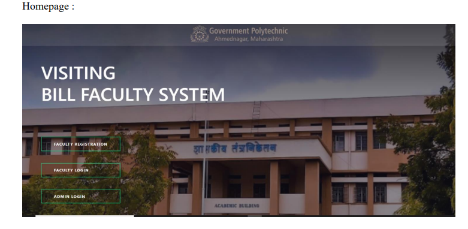
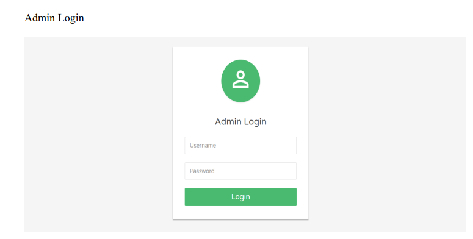
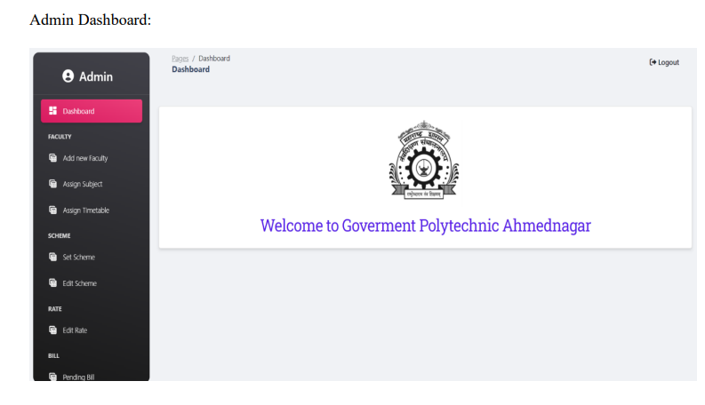
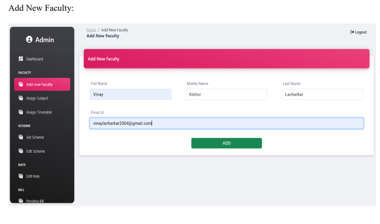
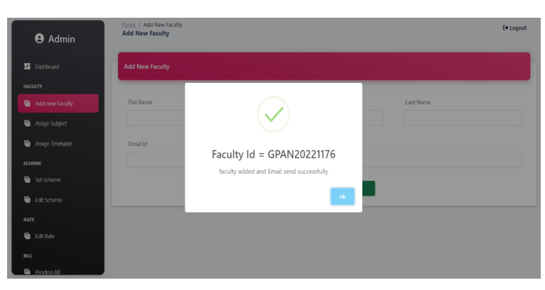
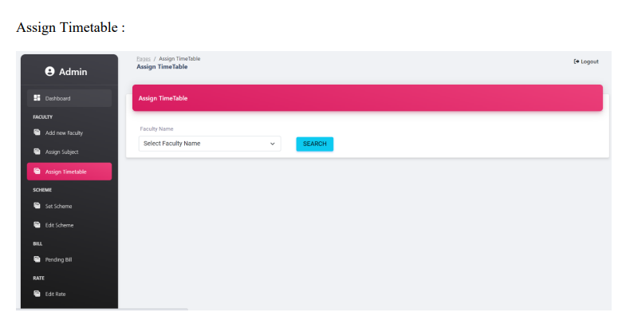
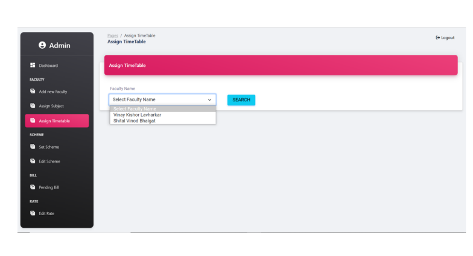
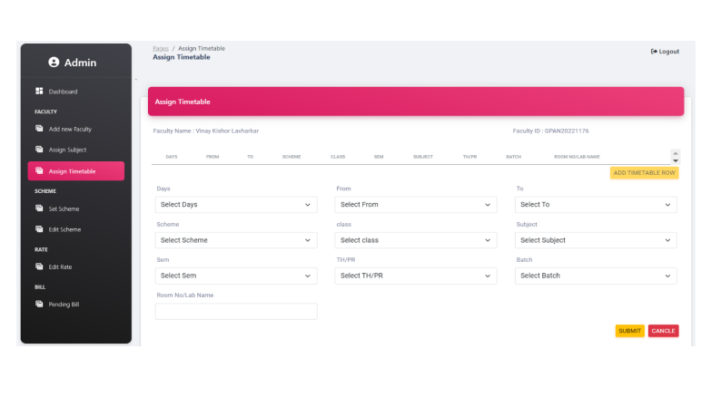
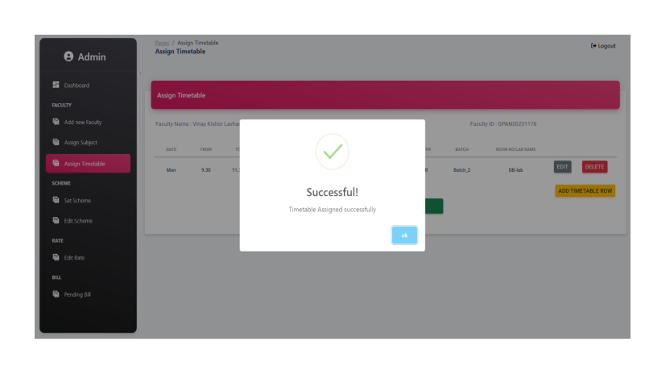
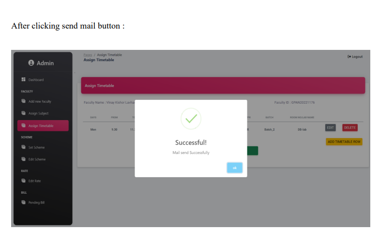
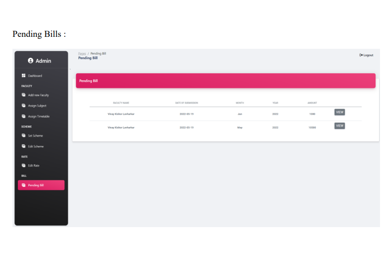
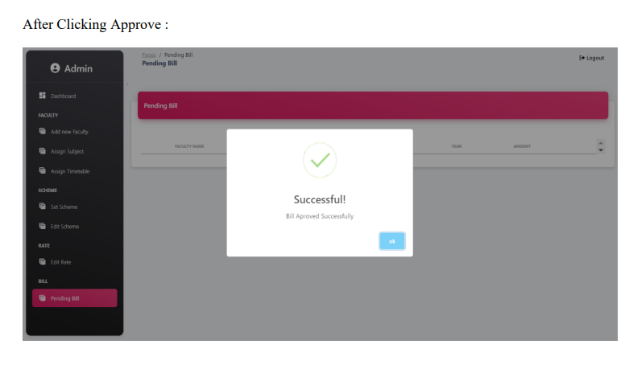

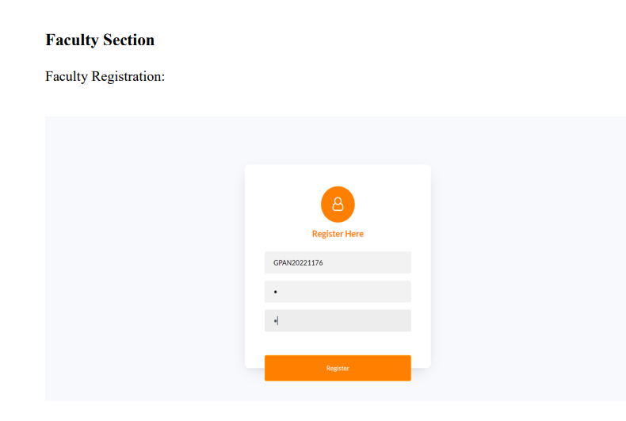
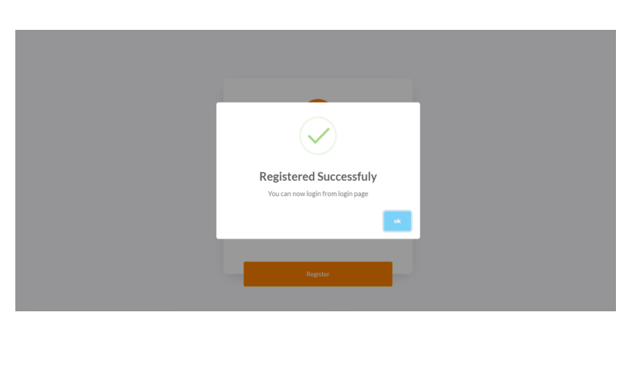
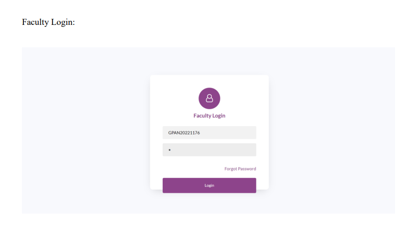
